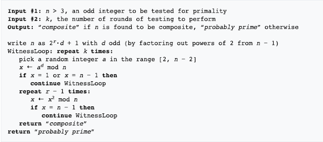

মৌলিক সংখ্যা বের করার অনেকগুলো উপায় আমরা জানি। খুব বেশি একটা উপায় না জানলেও ইরাটোস্থ্যানেস এর  সিভ (Sieve of Eratosthenes) – এই অ্যালগোরিদমটি প্রায় সবাই জানি। কিন্তু বড় যেকোনো সংখ্যার ক্ষেত্রে সিভ মেথডটা অনেক বেশি সময় নেয়। তাই সিভ এর পাশাপাশি যদি আরো কয়েকটি অ্যালগোরিদম আমাদের জানা থাকে তাহলে প্রাইম নাম্বার বের করা নিয়ে আর সমস্যা হবে না।

আমরা এখন মৌলিক সংখ্যা বের করার যে অ্যালগোরিদমটি দেখব সেটি হল- “মিলার-রবিন প্রাইমালিটি টেস্ট (Miller-Rabin Primality Test)”।
মিলার-রবিন অ্যালগোরিদম ভালোভাবে বুঝতে গেলে আমাদের ফার্মাটের লিটল থিওরেম ভালোভাবে বুঝতে হবে। ফার্মাটের লিটল থিওরেম এপ্লাই করেও আমরা মৌলিক সংখ্যা বের করতে পারি। কিন্তু ফার্মাটের থিওরেমের কিছু সীমাবদ্ধতা আছে যার ফলে সব সংখ্যার জন্য নির্ভুল মান পাওয়া যায় না।
আমরা প্রথমে ফার্মাটের লিটল থিওরেম দেখব, তারপর এর সীমাবদ্ধতা দেখব এবং সবশেষে ফার্মাটের লিটল থিওরেম ব্যবহার করে কিভাবে মিলার-রবিন প্রাইমালিটি টেস্ট কাজ করে তা দেখব।

ফার্মাটের লিটল থিওরেমঃ
ফার্মাটের লিটল থিওরেম অনুযায়ী, যদি n একটি মৌলিক সংখ্যা হয় এবং a যদি n এর চেয়ে ছোট যেকোন ধনাত্মক পূর্ণসংখ্যা  হয় (1 <= a < n ) তাহলে ,

an ≡ a (mod n)

বা, an – 1 ≡ 1 (mod n) ………. (i)

অর্থ্যাৎ, n এর চেয়ে ছোট a এর যেকোনো ধনাত্মক মানের জন্য যদি (i) নং সমীকরণ সত্য না হয় তাহলে n সংখ্যাটি মৌলিক নয় এবং যদি সত্য হয় তাহলে, n সংখ্যাটি মৌলিক সংখ্যা।

উদাহরণ দিয়ে বুঝা যাক –

ধরি, n = 4, এবং a = 2, তাহলে, (i)নং – এ মান বসিয়ে ,

=> 23 (mod 4) = 0

অর্থ্যাৎ, 4 সংখ্যাটি প্রাইম নয়।

আবার, ধরি , n = 7 এবং a = 5; তাহলে, (i)নং – এ মান বসিয়ে ,

=> 56 (mod 7) = 1

অর্থ্যাৎ, 7 সংখ্যাটি প্রাইম।

এভাবে, ফার্মাটের থিওরেম ব্যবহার করে, প্রাইম নাম্বার বের করা যায়।

কিন্তু এর কিছু সীমাবদ্ধতা আছে। যেমন-

ধরি, n = 15 এবং a = 4; তাহলে, (i)নং – এ মান বসিয়ে ,

=> 414 (mod 15) = 1

অর্থ্যাৎ, 15 সংখ্যাটি প্রাইম।কিন্তু 15 সংখ্যাটি কি মৌলিক সংখ্যা? না, 15 মৌলিক সংখ্যা নয়, কিন্তু ফার্মাটের থিওরেম অনুযায়ী, 15 সংখ্যাটিকে প্রাইম নাম্বার দেখাচ্ছে।
ফার্মাটের সাহায্যে প্রাইম নাম্বার বের করাটা মূলত একটি প্রোবাবিলিস্টিক প্রসেস। তাই এটি শুধুমাত্র একটি সংখ্যার মৌলিক হওয়ার সম্ভাব্যতা নির্দেশ করে। এখন, দেখা যাক, ফার্মাটের থিওরেম ব্যবহার করে কিভাবে আরেকটু নির্ভুলভাবে প্রাইম নাম্বার বের করা যায়।

এখন পর্যন্ত ফার্মাটের থিওরেম ব্যবহার করে শুধুমাত্র a- এর একটি মানের জন্য n সংখ্যাটি প্রাইম কি না তা নির্ধারণ করেছিলাম। কিন্তু এখন একটু অন্য পদ্ধতি এপ্লাই করা যাক। এবার  আমরা a – এর কয়েকটি মানের জন্য n -এর প্রাইমালিটি টেস্ট করব।

যেমন-
ধরি, a-এর কয়েকটি মান = k

এখন, যদি, k = 3 হয়, তাহলে a এর তিনটি মানের জন্য আমরা n – এর প্রাইমালিটি টেস্ট করব। যদি a-এর তিনটি মানের জন্যই ফার্মাটের থিওরেম সত্য হয় তাহলে আমরা সংখ্যাটি প্রাইম বলব। 

যদি তিনটি মানের মধ্যে একটির জন্যও ফার্মাটের থিওরেম সত্য না হয় তাহলে সংখ্যাটিকে নট-প্রাইম বলে ঘোষণা করব। একটি উদাহরণ দেখা যাক –

ধরি, n = 15, a = 4 , 3 , 2; তাহলে,

১। a = 4 এর জন্য,
 
=> 414 (mod 15) = 1; 

অর্থ্যাৎ, a = 4 এর জন্য 15 সংখ্যাটি প্রাইম।

২। a = 3 এর জন্য,
 
=> 314 (mod 15) ≠ 1; 

অর্থ্যাৎ, a = 3 এর জন্য 15 সংখ্যাটি প্রাইম নয়।

এতটুকু পর্যন্ত আসার পর আমরা বুঝে গেছি যে, 15 সংখ্যাটি প্রাইম নয়। a = 2 এর জন্য চেক না করলেও চলবে। কারণ, n তখনই প্রাইম হবে যখন a – এর k সংখ্যক মানের জন্যই ফার্মাটের থিওরেম সত্য হবে। 

আচ্ছা, এইখানে যেকোনো n – এর জন্য a – এর মান কত থেকে কত পর্যন্ত হতে পারে বলুন তো? 1 থেকে  n – 1 পর্যন্ত ? নাকি 2 থেকে n – 2 পর্যন্ত? একটু চিন্তা করে বের করে ফেলতে হবে কিন্তু !!

এতক্ষণ পর্যন্ত আসার পর আমরা এখন ফার্মাটের লিটল থিওরেম ব্যবহার করে বেশ নির্ভুলভাবেই( সম্পূর্ণ নির্ভুলভাবে নয় কিন্তু 😉 )  প্রাইম নাম্বার বের করে ফেলতে পারব। কিন্তু n = 65, 91, 703, 1729, 1921, 2821, 5611, 8911- এই কয়টি সংখ্যার জন্য ফার্মাটের থিওরেম সবসময়ই ব্যর্থ হবে। এই কয়টি সংখ্যা কম্পোজিট বা মৌলিক সংখ্যা না হওয়া সত্ত্বেও ফার্মাটের থিওরেম এই সংখ্যাগুলোকে মৌলিক বলে দাবি করবে। আর এই সমস্যা থেকে বের হয়ে আসার জন্যই আমরা মিলার-রবিন প্রাইমালিটি টেস্টের সাহায্য নেব।

ফার্মাটের থিওরেম এর মত , মিলার-রবিন প্রাইমালিটি টেস্ট ও একটি প্রোবাবিলিস্টিক এ্যালগোরিদম। কিন্তু প্রাইম নাম্বার বের করা ক্ষেত্রে এর error rate ফার্মাট অপেক্ষা কম।  তবে এখন দেখে ফেলা যাক, ফার্মাট থিওরেমের কাঁধের উপর বসে মিলার-রবিন এর সাহায্য নিয়ে কিভাবে নির্ভুলভাবে প্রাইম নাম্বার বের করা যায়।
 
 
### মিলার-রবিন টেস্টঃ

ফার্মাটের থিওরেমটা আবার মনে করা যাক –
an – 1 ≡ 1 (mod n)
এখানে, n হিসেবে আমরা শুধু বেজোড় সংখ্যাগুলোকেই  কাউন্ট করব। কারণ, আমরা জানি, 2 ছাড়া আর কোন জোড় সংখ্যাই মৌলিক নয়। মিলার-রবিন অ্যালগোরিদম এর মেইন আইডিয়া হল- (n – 1) -কে 2s.d – আকারে লিখব ;যেখানে d = বেজোড় সংখ্যা।

অর্থ্যাৎ, (n – 1) = (2 এর পাওয়ার * যেকোনো বেজোড় সংখ্যা)।

(n – 1) = 2s.d ....…..(ii)

(ii)নং সত্য হলে,

ad ≡ 1 (mod n) ……. (iii)

যেকোনো i ∈ { 0 , … , s−1} এর জন্য a2i.d ≡ -1(mod n) সত্য হবে। ……(iv)

(iii) অথবা (iv) এর যেকোনো একটি সত্য হবে।

#### প্রমাণঃ 

an – 1 ≡ a2s.d
 
=> an – 1 ≡ a2. 2s – 1.d
 
=> an – 1 ≡ (a2s – 1.d)2

অতএব, ফার্মাটের থিওরেম অনুযায়ী,

(a2s – 1.d)2 ≡ 1 (mod n)
 
(a2s – 1.d)  ≡ ±1 (mod n)

আমরা একটি উদাহরণ দিয়ে দেখব-

ধরি, n = 221,
এখন, n – 1 = 2s.d
 
=> 220 = 22.55
 
এখানে , s = 2 এবং d = 55।
 

a = 174 এর জন্য –

a2s – 1.d = 17422-1.55
 
= 17421.55  
 
= 174110 (mod 221)
 
= 220 = n – 1

অতএব, a = 174 এর জন্য n = 221 সংখ্যাটি প্রাইম।
 
এবার, a = 137 এর জন্য-

a2s – 1.d = 17422-1.55
 
= 13721.55  
 
= 137110 (mod 221)
 
= 188 ≠ n – 1
 
যেহেতু, উত্তরটি n – 1 এর সমান হয় নি, সেহেতু এখন আমরা a2s-2.d এর মান বের করব।
 
a2s – 2.d = 13722-2.55
 
= 13720.55               
 
= 13755 (mod 221)
 
= 205 ≠ n – 1

অর্থ্যাৎ, সংখ্যাটি মৌলিক নয়। কারণ সংখ্যাটি মৌলিক হতে হলে iii অথবা iv এর মধ্যে যেকোনো একটিকে সত্য হতে হবে।

যদি (iii) এবং (iv)  এর মধ্যে কোনটিই সত্য না হয় তাহলে সংখ্যাটি মৌলিক নয়।

আশা করি, এখন সূডোকোড দেখলে সবটুকু ক্লিয়ার হয়ে যাবে এবং নিজে নিজেই ইমপ্লিমেন্ট করা যাবে। 🙂

সূডোকোডঃ

Source: Wikipedia

পরবর্তী অংশে এটার ইমপ্লিমেন্টেশন ও কমপ্লেক্সিটি নিয়ে লিখার চেষ্টা করব, যদিও নিজে একটু পড়ালেখা করলেই এর ইমপ্লিমেন্টেশন ও কমপ্লেক্সিটি বুঝে ফেলা সম্ভব। কিছু লিংক দিয়ে দিচ্ছি, চাইলে আরও ডিটেইলে পড়ে নিতে পারেন।

Additional Resource Links: 

https://en.wikipedia.org/wiki/Fermat%27s_little_theorem
https://en.wikipedia.org/wiki/Miller%E2%80%93Rabin_primality_test
https://comeoncodeon.wordpress.com/2010/09/18/miller-rabin-primality-test/
https://miller-rabin.appspot.com/

প্র্যাকটিস এর জন্য প্রবলেমঃ
[SPOJ-Prime or Not](https://www.spoj.com/problems/PON/)
