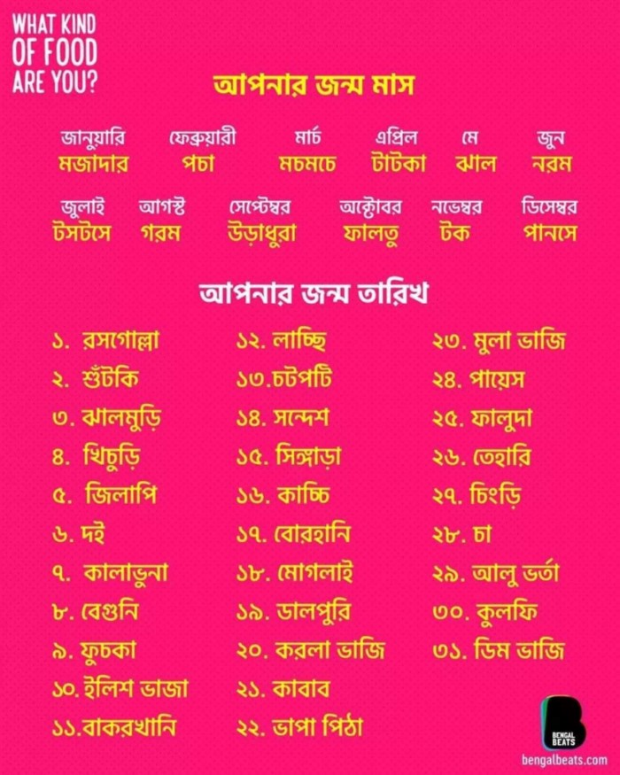
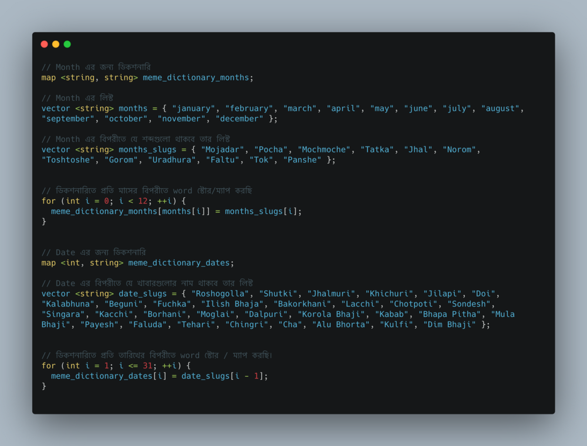

সিরিজের নামটা বেশ অদ্ভুত আর কনফিউজিং হলেও সিরিজটি ইন্টারেস্টিং হবে বলে আশা করছি। বেসিক্যালি এই সিরিজে আমরা রিয়েল লাইফ এর সাথে কানেক্ট করা যায় এমন মীম গুলোকে কম্পিউটার প্রোগ্রাম লিখে সলভ করার চেষ্টা করব এবং বিভিন্ন ধরনের ডেটা স্ট্রাকচার নিয়ে আলোচনা করব।এই সিরিজটার উদ্দেশ্য হচ্ছে, যাতে একটু মজা করে অন্যভাবে প্রবলেম সলভিং এর থিংকিং প্রসেস এবং ডেটা স্ট্রাকচার, অ্যালগোরিদম কিভাবে রিয়েল লাইফ প্রবলেম সলভিং এ কাজে লাগে এসব ব্যাপার নিয়ে জানা যায়, শেখা যায়। সিরিজটি প্রোগ্রামিং ল্যাংগুয়েজ স্পেসিফিক হবে না, মূলত থিংকিং প্রসেস, ডেটা স্ট্রাকচার, অ্যালগোরিদম এর উপর ফোকাস করা হবে। নিচের ছবিটি দেখি।

নিচের ছবি অনুযায়ী আমি হচ্ছি টাটকা তেহারি 🙄 । কিভাবে টাটকা তেহারি প্রথমে সেটা দেখার চেষ্টা করি। আমার জন্মমাস এপ্রিল, এর জন্য ‘টাটকা’ আর জন্ম তারিখ ২৬ তাই ‘তেহারি’।
আমরা কিন্তু মনের অজান্তেই চমৎকার একটি প্রবলেম সলভ করে ফেলেছি। আমাদের ব্রেইন এতো দ্রুত কাজ করে যে আমরা মুহূর্তের মধ্যে না বুঝেই একটি ডেটা স্ট্রাকচার এর প্রবলেম সলভ করে ফেলেছি। ডেটা স্ট্রাকচার এর প্রবলেম কেন বলেছি তা আরো ভালোভাবে বুঝা যাবে যখন আমরা প্রোগ্রাম লিখে প্রবলেমটি সমাধান করার চেষ্টা করব।

আমরা প্রথমে চিন্তা করি যে আমরা কিভাবে প্রবলেমটি মনের অজান্তেই সামাধান করে ফেললাম। মনে করি, আমাদের কাছে একটি অদ্ভুত ডিকশনারি আছে, যে ডিকশনারিতে প্রতি মাসের বিপরীতে ‘টাটকা, মজাদার’ এই টাইপ এর ওয়ার্ড স্টোর করা আছে, অর্থ্যাৎ আমি যদি বলি এপ্রিল মাস তাহলে আমি দেখতে পাবো যে এপ্রিল মাসের বিপরীতে ‘টাটকা’ শব্দটি ম্যাপ করা আছে। এভাবে আমরা একটি শব্দ পেয়ে গেলাম।

এবার আসি দ্বিতীয় শব্দতে। মনে করি, আমাদের কাছে আরেকটি ডিকশনারী আছে, যেটাতে ১ থেকে ৩১ পর্যন্ত প্রতি তারিখের বিপরীতে একটি খাবারের নাম স্টোর করা আছে। আমার জন্ম তারিখ ২৬ এবং আমি দেখতে পাচ্ছি ২৬ এর বিপরীতে ‘তেহারি’ শব্দটি স্টোর করা আছে।
আমি কাঙ্ক্ষিত ২টা শব্দই পেয়ে গেলাম। এবার ২টা শব্দ একসাথে যুক্ত করলেই আমরা পেয়ে যাব ‘টাটকা তেহারি’। আমাদের ব্রেইন এতো ভালো আর দ্রুত কাজ করে যে, এইটা সলভ করার জন্য যে ডিকশনারি বানাতে হয়েছে তা আমাদের মনের অজান্তেই হয়ে গিয়েছে।

এবার দেখা যাক কিভাবে কম্পিউটারে প্রোগ্রাম লিখে এটা সলভ করা যায়। এই যে মনের অজান্তে ডিকশনারি বানানো হয়ে গেল, এটা কিন্তু কম্পিউটারের ক্ষেত্রে কাজ করবে না, কম্পিউটার নিজে থেকে কিছুই বুঝতে পারে না, বুঝিয়ে দিতে হয়।
তাহলে প্রথমত আমাদের একটি ডিকশনারি লাগবে যেটাতে আমরা প্রতি মাস এবং তারিখের বিপরীতে অন্য কোন শব্দ স্টোর করে রাখতে পারব। আমরা এক্ষেত্রে হ্যাশম্যাপ / ম্যাপ ডেটা স্ট্রাকচার ব্যবহার করতে পারি। আমরা যদি সি++ এর সিনট্যাক্সে একটু দেখার চেষ্টা করি, তাহলে ব্যাপারটা এমন দাঁড়াবে।

আমাদের ডিকশনারি তৈরি করা শেষ। এই যে ডিকশনারি তৈরি করলাম এটাকে প্রোগ্রামিং এর ভাষায় ম্যাপিং বা ম্যাপ করা বলে। আমরা এই প্রোগ্রামে দুটি ডিকশনারি ব্যবহার করেছি। যারা একটু একটু প্রোগ্রামিং বুঝেন তারা অবশ্যই বুঝতে পারছেন আমরা চাইলে একটি ডিকশনারি দিয়ে আমাদের কাজটি করে ফেলতে পারতাম, সেক্ষেত্রে তারিখ (Date) কেও স্ট্রিং ফরম্যাটে স্টোর করা লাগত।
ডিকশনারি বানানো শেষ, এবার দেখি কুয়েরি কিভাবে করব। কুয়েরি বলতে বুঝাচ্ছি, আমরা মাস ও তারিখ ইনপুট দিবো, আর প্রোগ্রামটি আউটপুট হিসেবে আমি কোন ধরনের খাবার তা শো করবে। একটা উদাহরণ দেই, আমি যদি April 26 ইনপুট দেই তাহলে আমাকে আউটপুট দিবে “Tatka Tehari” ।
কুয়েরি করার ব্যাপারটা সি++ সিনট্যাক্সে দেখার চেষ্টা করি।

