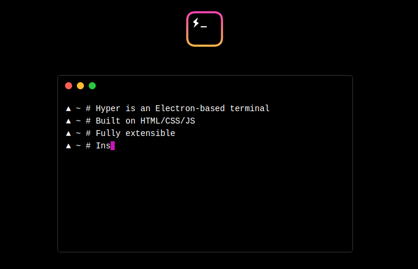
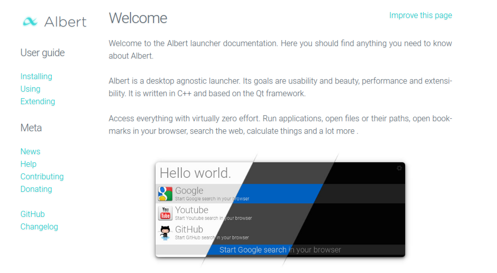
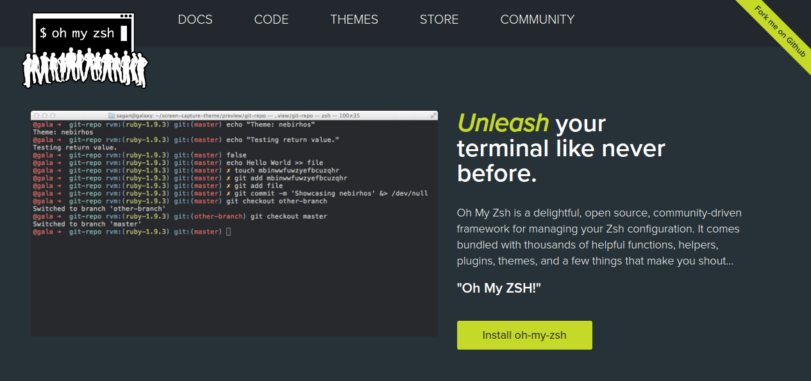
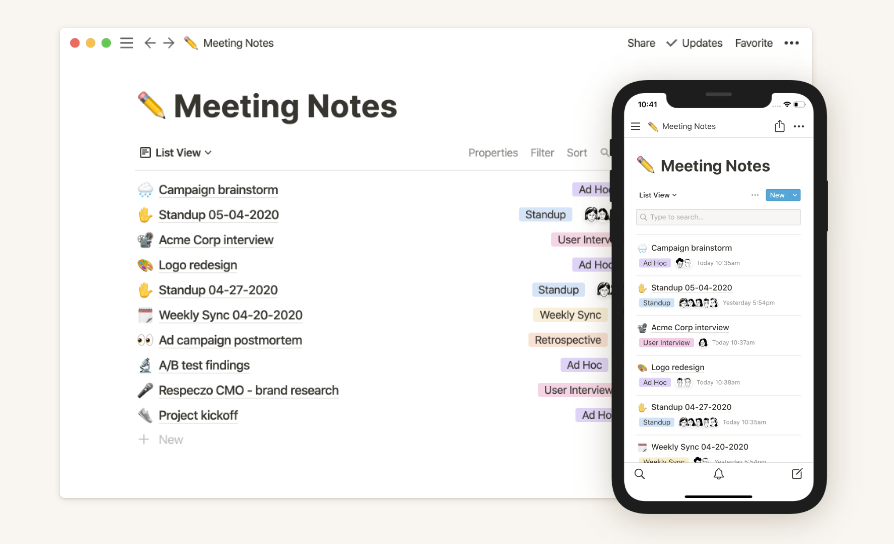
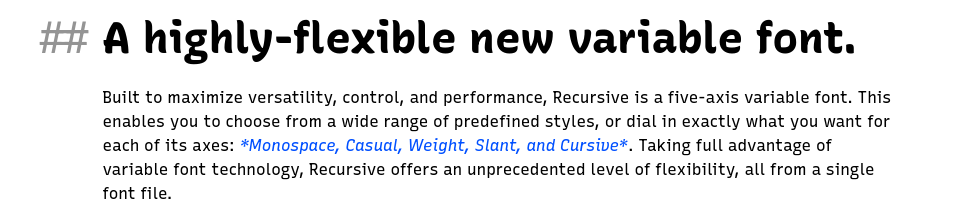
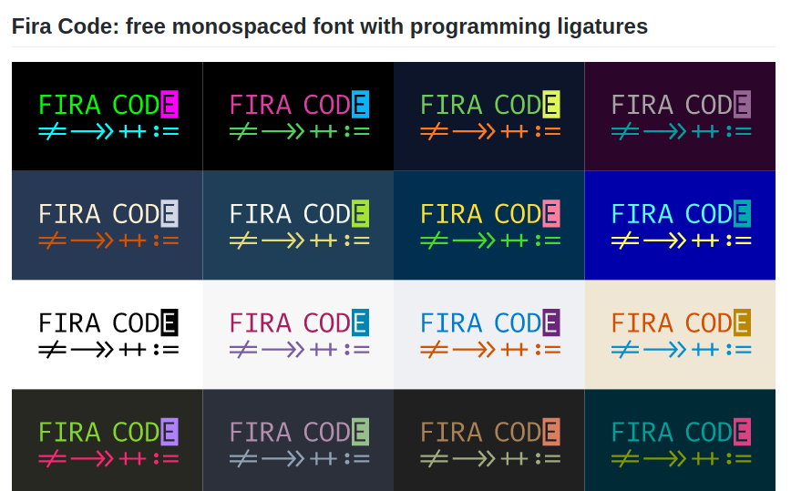

Manjaro is a free and open-source Linux distribution based on the Arch Linux operating system. I use it as my daily driving development device. 

One of most beautiful features of Manjaro is its Rolling Release Development Model where the same core system is continually updated and upgraded rather than reinstalling the new version or release to get the latest features.

I have been using Manjaro for four months. I use some tools on a daily basis to make my Manjaro user experience better. These tools are not integrated with Manjaro if you have a fresh copy Manjaro installed in your system. So, if you are interested to know more about the tools I use, read it further below.


## Tools that I use

1. Install ```base-devel``` and ```git``` (Prerequisite for install other packages and tools)
    - You will need a package group ```base-devel``` which includes tools for building (compiling and linking).
    - To install ```base-devel``` and ```git``` from the terminal
        ```
        sudo pacman -S base-devel git
        ```
2. Install ```Snapcraft``` Store and ```yay``` (For installing and managing packages)
    - I found ```yay``` helpful over ```pacman``` for installing some of the packages from ```AUR``` (Arch User Repository).
    - To install ```Snapcraft``` from your terminal, type
        ```
        sudo pacman -S snapd
        sudo systemctl enable --now snapd.socket
        sudo ln -s /var/lib/snapd/snap /snap
        ```
    - To install ```yay```, type
        ```
        sudo git clone https://aur.archlinux.org/yay-git.git
        cd yay-git
        makepkg -si
        ```
3. Install ```Google Chrome```
    - To install ```google-chrome``` using yay, type 
        ```
        yay -S google-chrome
        ```
4. Install ```hyper.js``` (My default terminal)
    - ```Hyper``` is an ```electron``` based terminal. [Website](https://hyper.is)
    - You can use other terminal like iTerm, konsole(manjaro built in terminal).

    

    - To install ```hyper```, type - 
        ```
        yay -S hyper
        ```
5. Install ```Albert```
    - If you were a Mac user, you might get used to ```Spotlight``` or ```Alfred```.  [Website](https://albertlauncher.github.io/)
    - ```Albert``` is a alternative to ```Spotlight``` or ```Alfred``` for linux.

    

    - To install ```albert```, type-
        ```
        sudo pacman -S albert
        ```
6. Install ```Vim```
    - I use vim for quick text editing. [Website](https://www.vim.org/)
    - To install vim, type -
        ```
        sudo pacman -S vim
        ```
7. Install ```zsh (Oh My Zsh)```
    - I use zsh (Z-Shell) as my default shell. [Website](https://ohmyz.sh/)
    
    

    - To install, type-
        ```
        sh -c "$(curl -fsSL https://raw.github.com/ohmyzsh/ohmyzsh/master/tools/install.sh)"
        ```
8. Install ```Notion```
    - Notion is a all in one workspace for taking notes, keeping track of your tasks, kanban board, managing projects and many more. I use it on a daily basis. [Website](https://notion.so)

    

    - To install ```Notion```, type-
        ```
        sudo snap install notion-snap
        ```
9. Install ```Visual Studio Code (vscode)```
    - VSCode is my primary code editor and have been using it for a long time.
    - To install VSCode, type-
        ```
        yay -S vscode
        ```
10. ```Fira Code``` and ```Recursive``` Fonts
    - These two fonts I use for my daily programming and development stuff.
    - Both of these fonts support font ligatures.

    - [Recursive Font Website](https://recursive.design)
    

    - [Fira Code Website](https://github.com/tonsky/FiraCode)
    


    
